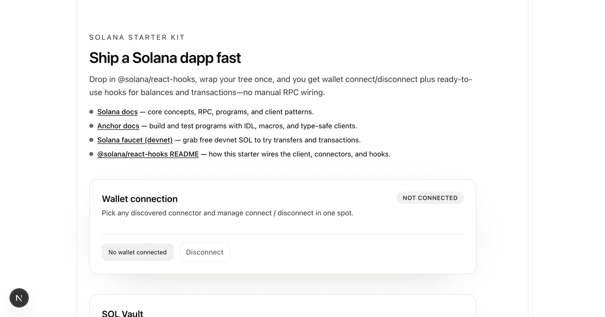

<div align="center">

# 🎓 Scholarship DAO

**A community-governed, on-chain scholarship protocol built on Solana.**

Donate SOL → Become a member → Propose → Vote → Execute. Every state transition is verifiable on-chain, every grant disburses deterministically from a program-derived treasury — no admin key required.

<p>
  
  
  
  
  
  
  
</p>

**English** · [简体中文](./README.zh-CN.md)

[Features](#-features) · [Architecture](#-architecture) · [Quick Start](#-quick-start) · [Program API](#-program-api) · [Roadmap](#-roadmap)



</div>

---

## 📖 Overview

**Scholarship DAO** is a production-grade governance layer for community-funded scholarships on Solana. Contributors donate SOL into a program-derived treasury, automatically become voting members, and collectively decide which applicants receive grants. Proposals finalize deterministically when voting ends: if votes pass the quorum and threshold, funds are disbursed in the same transaction — no multisig, no admin override, no trust required beyond the verified program.

The project pairs a **auditable Anchor program** (~700 lines of Rust) with a **polished Next.js frontend** powered by the modern [`@solana/kit`](https://github.com/anza-xyz/kit) stack and [Codama](https://github.com/codama-idl/codama)-generated type-safe clients.

---

## ✨ Features

### On-chain Governance
- 🏛️ **Permissionless DAO creation** — any wallet can spin up an isolated DAO with its own treasury, voting rules, and metadata.
- 💰 **Donate-to-join membership** — one-step PDA membership via `init_if_needed`, with cumulative donation tracking per member.
- 📝 **Structured proposals** — amount, recipient, reason, and an IPFS `proof_cid` for off-chain evidence.
- 🗳️ **Per-member For / Against voting** — one vote per member per proposal, enforced by a `VoteRecord` PDA.
- ⏱️ **Deadline-based finalization** — no early execution: proposals can only be executed **after** the voting period elapses.
- ✅ **Deterministic execution rules** — enforced on-chain:
  ```
  votes_for > votes_against
  votes_for ≥ vote_threshold
  (votes_for + votes_against) ≥ quorum
  → treasury → recipient (atomic SOL transfer)
  ```
- 🏦 **PDA-owned treasury** — funds are held by a `SystemAccount` PDA that only the program can sign for, isolated per-DAO.
- 🔒 **Admin-gated metadata** — editable name / description / icon, scoped to the DAO admin via `has_one`.
- 🚫 **Cancelable proposals** — proposer or admin can cancel a pending application.
- 📣 **Rich event log** — `DaoInitialized`, `Donated`, `ApplicationCreated`, `Voted`, `ApplicationExecuted`, `ApplicationCancelled`, `DaoMetadataUpdated`.

### Frontend Experience
- ⚡ **Next.js 16 App Router + React 19** with server components and streaming.
- 🔌 **Wallet Standard integration** — auto-detects all Wallet Standard wallets (Phantom, Solflare, Backpack, …).
- 🎨 **Modern, accessible UI** — Tailwind CSS v4, custom design tokens, aurora background, keyboard shortcuts.
- 📊 **Live analytics** — treasury history charts, donor leaderboard, activity feed, per-proposal vote progress.
- 🔄 **Auto-refresh** — on-chain data polls every 30s via SWR.
- 📎 **IPFS proof uploads** — proposals attach off-chain evidence via a server-side Pinata proxy (10 MB limit, MIME-whitelisted).
- 🧩 **Type-safe client** — Codama generates instruction builders, account decoders, and PDA finders directly from the Anchor IDL.
- 🌐 **Cluster-aware** — switch between Devnet / Mainnet-Beta / custom RPC with one click.

---

## 🏗️ Architecture

```
┌──────────────────────────────────────────────────────────────────────────┐
│                             Next.js Frontend                             │
│  app/                                                                    │
│  ├── page.tsx             Home · DAO explorer · live stats               │
│  ├── dao/[address]/       DAO workspace (overview / proposals / treasury │
│  │                                       / members / settings / activity)│
│  ├── me/                  "My Workspace" — DAOs I joined / created       │
│  ├── api/ipfs-upload/     Server-side Pinata proxy (Node runtime)        │
│  ├── components/          UI · charts · layout · DAO-specific widgets    │
│  ├── lib/                                                                │
│  │   ├── wallet/          Wallet Standard adapter + signer               │
│  │   ├── hooks/           SWR data hooks (useDaos / useMembers / …)      │
│  │   ├── dao/             PDA helpers · string codec · status utils     │
│  │   └── ipfs.ts          CID validation + gateway URL builder           │
│  └── generated/           ← Codama-generated instructions & decoders     │
└─────────────────────────────────┬────────────────────────────────────────┘
                                  │  @solana/kit (RPC + tx signing)
                                  ▼
┌──────────────────────────────────────────────────────────────────────────┐
│                     Anchor Program (scholarship_dao)                     │
│  anchor/programs/scholarship_dao/src/                                    │
│  ├── lib.rs                                                              │
│  │   ├── initialize_dao        → Dao PDA                                 │
│  │   ├── donate                → Member PDA + Treasury PDA               │
│  │   ├── create_application    → Application PDA                         │
│  │   ├── vote                  → VoteRecord PDA                          │
│  │   ├── execute               → SOL transfer from Treasury              │
│  │   ├── cancel_application                                              │
│  │   └── update_dao_metadata                                             │
│  └── tests.rs                  LiteSVM-based unit tests                  │
└──────────────────────────────────────────────────────────────────────────┘
```

### On-chain account layout

| PDA | Seeds | Purpose |
| --- | --- | --- |
| `Dao` | `["dao", creator, dao_id]` | Governance config + counters |
| `Treasury` | `["treasury", dao]` | PDA-owned `SystemAccount` holding SOL |
| `Member` | `["member", dao, donor]` | Membership record + lifetime donation total |
| `Application` | `["app", dao, app_id]` | Proposal (amount, recipient, reason, proof CID, votes, status) |
| `VoteRecord` | `["vote", application, member]` | Enforces one vote per member per proposal |

---

## 📦 Tech Stack

| Layer | Stack |
| --- | --- |
| Smart contract | **Rust** · **Anchor 0.32.1** · **LiteSVM** (tests) |
| Client SDK | **`@solana/kit` 6** · **Codama** (IDL → TS codegen) |
| Frontend | **Next.js 16** · **React 19** · **TypeScript 5** · **Tailwind CSS v4** |
| Data | **SWR** · **Recharts** · **Sonner** (toasts) |
| Wallet | **Wallet Standard** (`@wallet-standard/*`) |
| Storage | **IPFS via Pinata** (off-chain proof materials) |
| Tooling | **pnpm** · **ESLint 9** · **Prettier 3** |

---

## 🚀 Quick Start

### Prerequisites

- **Node.js** ≥ 20
- **pnpm** ≥ 9 (`npm i -g pnpm`)
- **Rust** (stable toolchain)
- **Solana CLI** ≥ 1.18 ([install](https://docs.solana.com/cli/install-solana-cli-tools))
- **Anchor CLI** 0.32.1 (`avm install 0.32.1 && avm use 0.32.1`)

### 1. Clone & install

```bash
git clone https://github.com/rzexin/solana_scholarship_dao.git
cd solana_scholarship_dao
pnpm install
```

### 2. Configure environment

Create a `.env.local` in the project root:

```bash
# Server-only — used by /api/ipfs-upload
PINATA_JWT=your_pinata_jwt_here

# Optional: custom gateway for reading IPFS content in the browser
NEXT_PUBLIC_IPFS_GATEWAY=https://gateway.pinata.cloud/ipfs/
```

> Get a free Pinata JWT at <https://app.pinata.cloud/developers/api-keys>.

### 3. Build the Anchor program & generate the client

```bash
# Builds the program + regenerates the TypeScript client from the IDL
pnpm run setup
```

Internally this runs:

```bash
pnpm run anchor-build   # cd anchor && anchor build
pnpm run codama:js      # codama run js  (IDL → app/generated/scholarship_dao)
```

### 4. (Optional) Deploy to Devnet

```bash
solana config set --url https://api.devnet.solana.com
solana airdrop 2
cd anchor
anchor deploy
```

Update the `declare_id!` in `anchor/programs/scholarship_dao/src/lib.rs` and the `[programs.devnet]` entry in `anchor/Anchor.toml` if you deploy under your own address, then rerun `pnpm run setup` to refresh the generated client.

### 5. Run the frontend

```bash
pnpm dev
# → http://localhost:3000
```

### 6. Run the on-chain tests

```bash
pnpm run anchor-test
```

Tests run against [LiteSVM](https://github.com/LiteSVM/litesvm) — no validator required, millisecond feedback.

---

## 📚 Program API

All instructions are defined in [`anchor/programs/scholarship_dao/src/lib.rs`](./anchor/programs/scholarship_dao/src/lib.rs).

| Instruction | Signer | Description |
| --- | --- | --- |
| `initialize_dao` | creator | Creates a DAO PDA with governance params (`vote_threshold`, `quorum`, `voting_period` ≥ 60s, `min_donation`) and 32/128/96-byte fixed-length name / description / icon_uri. |
| `donate` | donor | Transfers SOL to the DAO treasury; auto-creates the `Member` PDA on first donation. |
| `create_application` | proposer | Submits a grant request (amount, recipient, reason ≤ 200 chars, proof_cid ≤ 64 chars). Proposer **does not need to be a member**. |
| `vote` | member | Casts a For / Against vote. One vote per member per proposal, enforced by `VoteRecord` PDA. Must be cast before `voting_ends_at`. |
| `execute` | anyone | After the voting deadline, if **for > against**, **for ≥ threshold**, and **total votes ≥ quorum**, atomically transfers `amount` lamports from treasury → recipient and marks the application `Executed`. |
| `cancel_application` | proposer or admin | Cancels a `Pending` application. |
| `update_dao_metadata` | admin | Updates any of name / description / icon_uri (each optional). Enforced via `has_one = admin`. |

### Errors

`InvalidGovernanceParams` · `DonationTooSmall` · `NotAMember` · `ReasonTooLong` · `ProofCidTooLong` · `AmountMustBePositive` · `ApplicationNotPending` · `ThresholdNotMet` · `QuorumNotMet` · `VoteAgainstWins` · `VotingEnded` · `VotingNotEnded` · `InsufficientTreasury` · `RecipientMismatch` · `NotProposerOrAdmin` · `AmountOverflow`

---

## 🧪 Scripts

| Command | Description |
| --- | --- |
| `pnpm dev` | Run Next.js dev server |
| `pnpm build` | Production build |
| `pnpm start` | Start production server |
| `pnpm lint` | Run ESLint |
| `pnpm format` / `pnpm format:check` | Format code with Prettier |
| `pnpm run anchor-build` | Build the Anchor program |
| `pnpm run anchor-test` | Run LiteSVM tests |
| `pnpm run codama:js` | Regenerate TypeScript client from the IDL |
| `pnpm run setup` | `anchor-build` + `codama:js` |
| `pnpm run ci` | `build` + `lint` + `format:check` |

---

## 📁 Project Structure

```
solana_scholarship_dao/
├── anchor/                              # Anchor workspace
│   ├── programs/scholarship_dao/
│   │   ├── src/
│   │   │   ├── lib.rs                   # Program logic, accounts, events, errors
│   │   │   └── tests.rs                 # LiteSVM unit tests
│   │   └── Cargo.toml
│   ├── Anchor.toml
│   └── Cargo.toml
├── app/                                 # Next.js App Router
│   ├── page.tsx                         # Landing + DAO explorer
│   ├── layout.tsx                       # Root layout (fonts, providers, footer)
│   ├── dao/[address]/                   # Per-DAO workspace
│   │   ├── overview-tab.tsx
│   │   ├── proposals/                   # List · detail · create
│   │   ├── treasury/                    # Balance chart + donor leaderboard
│   │   ├── members/                     # Member roster
│   │   ├── activity/                    # Event feed
│   │   └── settings/                    # Admin metadata editor
│   ├── me/                              # "My Workspace"
│   ├── api/ipfs-upload/route.ts         # Pinata proxy (Node runtime)
│   ├── components/                      # UI, charts, layout, DAO widgets
│   ├── lib/
│   │   ├── wallet/                      # Wallet Standard integration
│   │   ├── hooks/                       # SWR data hooks
│   │   ├── dao/                         # PDA helpers, string codec, status utils
│   │   ├── ipfs.ts                      # CID validation + gateway
│   │   └── solana-client.ts             # @solana/kit RPC setup
│   └── generated/scholarship_dao/       # Codama-generated (do not edit)
├── codama.json                          # IDL → TS codegen config
├── next.config.ts
├── package.json
└── tsconfig.json
```

---

## 🛣️ Roadmap

- [ ] SPL-Token (USDC) treasuries in addition to native SOL
- [ ] Quadratic / weighted voting by donation history
- [ ] Vote delegation
- [ ] Proposal comments / discussion threads (off-chain, IPFS)
- [ ] Squads multisig integration for admin operations
- [ ] Mainnet-Beta deployment

---

## 🤝 Contributing

Contributions are welcome! Please:

1. Fork the repo and create a feature branch: `git checkout -b feat/your-feature`.
2. Run `pnpm run ci` before pushing — all commits must pass `build` + `lint` + `format:check`.
3. Add or update tests in `anchor/programs/scholarship_dao/src/tests.rs` for any on-chain change.
4. Open a PR with a clear description of the motivation and the change.

For non-trivial changes, please open an issue first to discuss.

---

## 📄 License

Released under the **MIT License**. See [LICENSE](./LICENSE) for details.

---

## 🙏 Acknowledgements

- [Solana Labs](https://solana.com/) · [Anza](https://www.anza.xyz/) — runtime, RPC, `@solana/kit`
- [Coral-xyz / Anchor](https://www.anchor-lang.com/) — the framework this program is built on
- [Codama](https://github.com/codama-idl/codama) — IDL-driven TypeScript codegen
- [LiteSVM](https://github.com/LiteSVM/litesvm) — fast, headless test runtime
- [Pinata](https://www.pinata.cloud/) — IPFS pinning
- Built for **Solana Frontier**

---

<div align="center">

**Built with ❤️ on Solana**

[⬆ Back to top](#-scholarship-dao)

</div>
